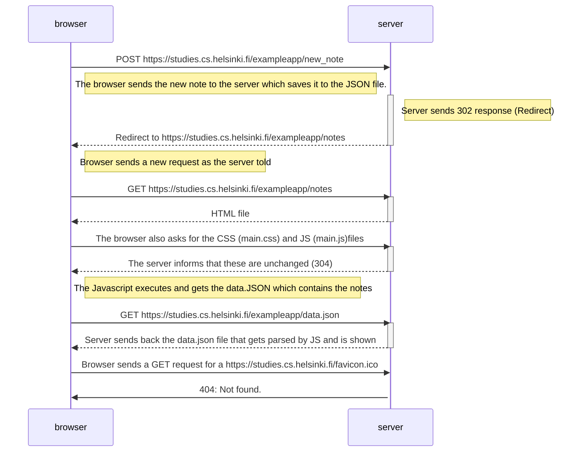

```mermaid
sequenceDiagram
    participant browser
    participant server

    browser->>server: POST https://studies.cs.helsinki.fi/exampleapp/new_note
    Note right of browser: The browser sends the new note to the server which saves it to the JSON file.
    activate server

    Note right of server: Server sends 302 response (Redirect)

    server-->>browser: Redirect to https://studies.cs.helsinki.fi/exampleapp/notes
    deactivate server

    Note right of browser: Browser sends a new request as the server told

    browser->>server: GET https://studies.cs.helsinki.fi/exampleapp/notes

    activate server
    server-->>browser: HTML file
    deactivate server

    browser->>server: The browser also asks for the CSS (main.css) and JS (main.js)files
    activate server
    server-->>browser: The server informs that these are unchanged (304)
    deactivate server

    Note right of browser: The Javascript executes and gets the data.JSON which contains the notes

    browser->>server: GET https://studies.cs.helsinki.fi/exampleapp/data.json
    activate server
    server-->>browser: Server sends back the data.json file that gets parsed by JS and is shown
    deactivate server

    browser->>server: Browser sends a GET request for a https://studies.cs.helsinki.fi/favicon.ico
    activate server
    server->>browser: 404: Not found.

```
  