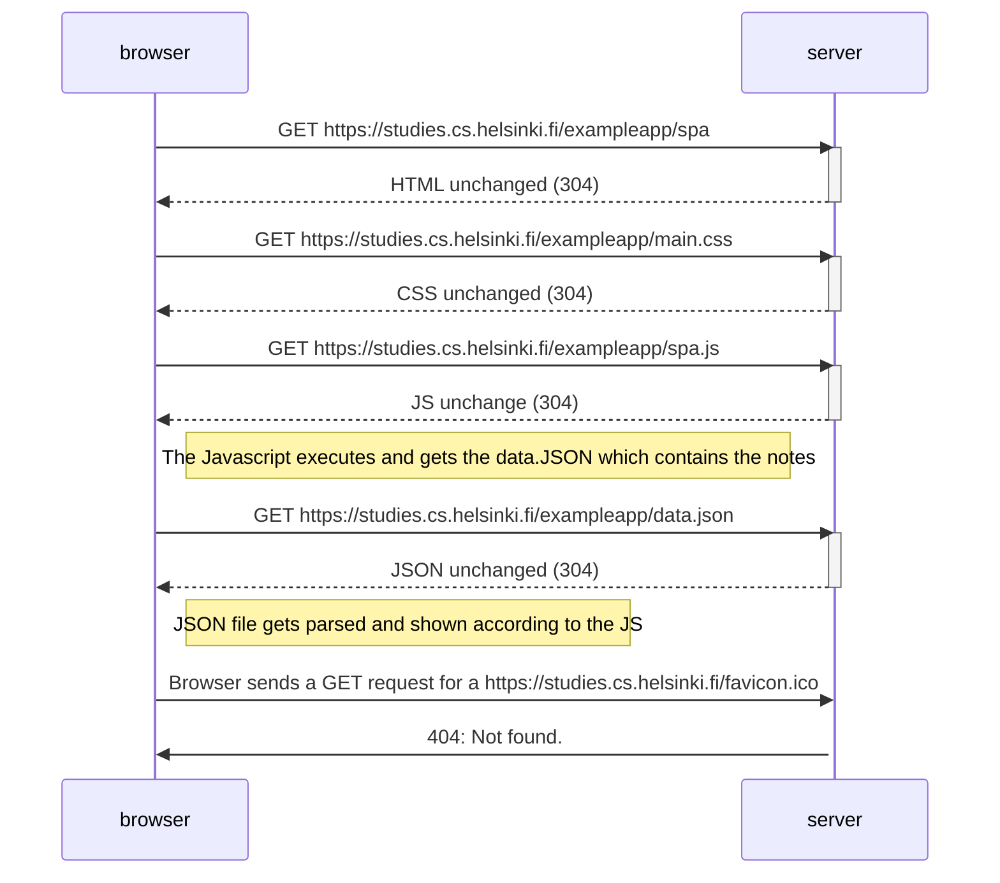

```mermaid
sequenceDiagram
    participant browser
    participant server

    browser->>server: GET https://studies.cs.helsinki.fi/exampleapp/spa

   
    activate server
    server-->>browser: HTML unchanged (304)
    deactivate server

    browser->>server: GET https://studies.cs.helsinki.fi/exampleapp/main.css

    activate server
    server-->>browser: CSS unchanged (304)
    deactivate server

    browser->>server: GET https://studies.cs.helsinki.fi/exampleapp/spa.js
    activate server
    server-->>browser: JS unchange (304)
    deactivate server

    Note right of browser: The Javascript executes and gets the data.JSON which contains the notes

    browser->>server: GET https://studies.cs.helsinki.fi/exampleapp/data.json
    activate server
    server-->>browser: JSON unchanged (304)
    deactivate server

    Note right of browser: JSON file gets parsed and shown according to the JS

    browser->>server: Browser sends a GET request for a https://studies.cs.helsinki.fi/favicon.ico
    activate server
    server->>browser: 404: Not found.

```